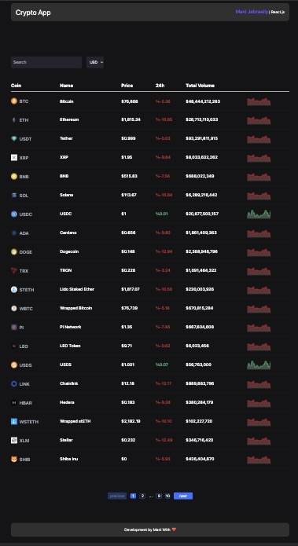

># **Project Title**
 ##### Cryptocurrency Market Overview

># **Description**

This project is a web application built with React.js ,providing a real-time overview of the cryptocurrency market 

### Features:
- Display cryptocurrencies ranked by market capitalization
- Real-time cryptocurrency price
- Search functionality to find specific cryptocurrencies
- Interactive charts for each cryptocurrency, displaying price history
 

### Technologies Used:
- React.Js
- Tailwind Css
- api from https://www.coingecko.com

### Libraries Used:
- React Suite  https://rsuitejs.com
- recharts     https://recharts.org

># **Getting started**

To get the frontend running locally:

- Clone this repo
- `npm install` to install all req'd dependencies
- `npm run dev` to start the local server (this project Vite)

># **Demo**

[**Click here to see demo**](https://mani-jebraeily.github.io/crypto-app/)
 
 

**`Desktop design`**

